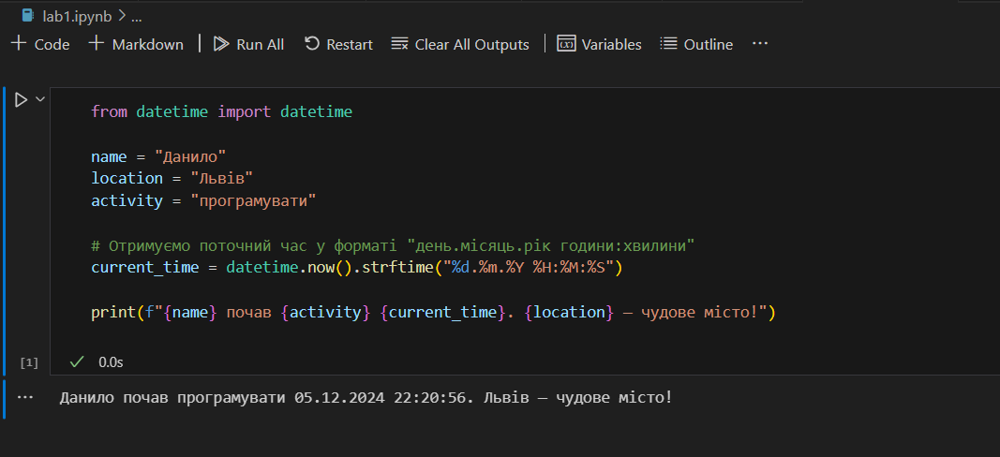

# Звіт до першої лабораторної
## Тема: перша програма на мові *Python*

### Виконання роботи
- Результати виконання завдання:
    1. Виконали першу програму, результат виконання: ;
    1. Модифікували програму та використали [Python Notebook для її виконання](lab1.ipynb);
    
    
    
    1. Програма вивела значення
    1. Отримано наступні результати: Данило почав програмувати 05.12.2024 22:22:00. Львів — чудове місто!
    1. Навчились прості програми на мові Python


___


```Python
from datetime import datetime

name = "Данило"
location = "Львів"
activity = "програмувати"

# Отримуємо поточний час у форматі "день.місяць.рік години:хвилини"
current_time = datetime.now().strftime("%d.%m.%Y %H:%M:%S")

print(f"{name} почав {activity} {current_time}. {location} — чудове місто!")


```
